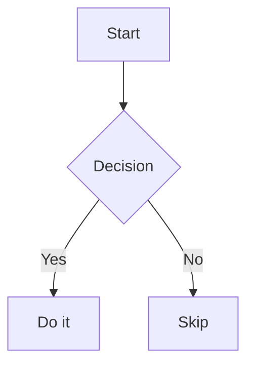

# Obsidian Core — Vault Manager

Vault: `/home/yepes/Documents/Vaults/Orchestrator/`
Theme: Obsidian Gruvbox | Snippet: `left-start-notes`

## PRECEDENCE

Plugin skills (obsidian-tasks, obsidian-kanban, etc.) take precedence over this
skill for their specific domains. Always check if a plugin skill exists before
using core patterns for plugin-related features.

---

## CRITICAL RULES

1. Always create files inside the vault at `/home/yepes/Documents/Vaults/Orchestrator/`
2. Use exact syntax documented below — wrong syntax breaks features
3. File paths in configs: vault-relative, forward slashes, no leading `/`
4. All `.md` files: UTF-8. All `.json` files: UTF-8, standard JSON.

---

## WIKILINKS

```markdown
[[Note Name]]              # Basic wikilink
[[Note Name|Display Text]] # Aliased
[[Note Name#Heading]]      # To heading
[[Note Name^blockid]]      # To block
[[#Heading]]               # Within same note
[[folder/Note Name]]       # Disambiguate same-name files
```

- Case-insensitive. No `.md` extension. `|` for alias.
- Use `/` for subfolders relative to vault root.

## EMBEDS

```markdown
![[Note Name]]              # Embed full note
![[Note Name#Section]]      # Embed heading section
![[Note Name^blockid]]      # Embed block
![[image.png|300x200]]      # Image with dimensions
![[document.pdf#page=3]]    # PDF at page
```

## CALLOUTS

```markdown
> [!info] Title here
> Content body. Supports **markdown**, [[links]], embeds.

> [!note]+ Foldable (collapsed)
> Hidden until clicked

> [!warning]- Foldable (expanded)
> Visible by default
```

Types: `note`, `abstract`/`summary`/`tldr`, `info`, `todo`, `tip`/`hint`/`important`,
`success`/`check`/`done`, `question`/`help`/`faq`, `warning`/`caution`/`attention`,
`failure`/`fail`/`missing`, `danger`/`error`, `bug`, `example`, `quote`/`cite`

- `+` = default collapsed, `-` = default expanded, no marker = not foldable
- Title is optional. Content can have any markdown, code blocks, embeds, links.

## FRONTMATTER / PROPERTIES

```yaml
---
title: Note Title
tags: [tag1, tag2]
status: draft
priority: 3
due: 2025-12-31
complete: false
aliases: [Alt Name]
cssclasses: [wide-layout]
---
```

Property types: Text, Number (`42`), Checkbox (`true`/`false`), Date (`YYYY-MM-DD`),
Date & time (`2025-01-15T09:00:00`), Tags (`[a, b]`), List, Number list.

- Frontmatter MUST be at line 1-3, delimited by `---`
- Tags in frontmatter: NO `#` prefix. Tags in body: `#` required.
- `aliases` create alternative wikilink targets
- `cssclasses` apply CSS classes to note rendering
- Multi-word keys must be quoted: `"due date": 2025-01-15`

## TAGS

```markdown
#tag                       # Body tag
#nested/tag                 # Nested tag
```

- Body tags need `#`. Frontmatter tags don't.
- `/` creates hierarchy: `#a/b/c` belongs to `#a`, `#a/b`, `#a/b/c`
- Case-insensitive. Not parsed in code blocks or `%%` comments.

## TABLES

```markdown
| Header 1 | Header 2 |
|----------|----------|
| Cell     | Cell     |
```

## CODE BLOCKS

````markdown
```python title="hello.py"
print("Hello")
```
````

Language tag is case-insensitive. `title="..."` adds a title bar above the block.

## MERMAID DIAGRAMS

````markdown

````

Types: `graph TD`/`LR`, `flowchart`, `sequenceDiagram`, `classDiagram`,
`stateDiagram-v2`, `erDiagram`, `gantt`, `pie`, `mindmap`, `timeline`,
`gitGraph`, `sankey`, `quadrantChart`, `kanban`, `zenuml`, `C4Context`

- First non-comment line must be diagram type declaration
- Node IDs: no spaces. Use descriptive names like `start`, `decision_node`.

## MATH / LATEX

```markdown
$E = mc^2$                # Inline
$$
\int_{0}^{\infty} e^{-x^2} dx
$$                          # Block
```

## FOOTNOTES

```markdown
Text with a footnote.[^1]

[^1]: Footnote content at bottom.
```

## COMMENTS

```
%% inline comment %%
%%
block comment
%%
```

---

## INTERNAL LINKS TO BLOCKS

Create block ID at end of block:
```markdown
This paragraph can be referenced. ^my-id
```

Link to it:
```markdown
[[Note^my-id]]
[[Note^my-id|Click here]]
```

Block IDs: `^` prefix, unique within note, letters/numbers/hyphens only.

---

## OBSIDIAN URI SCHEME

```
obsidian://open?vault=VaultName&file=Note.md
obsidian://open?vault=VaultName&file=Note.md%23Heading
obsidian://open?vault=VaultName&file=Note.md%5Eblockid
obsidian://daily?vault=VaultName
obsidian://new?vault=VaultName&name=Note&content=Hello
obsidian://search?vault=VaultName&query=term
```

- Parameters must be URI-encoded (`%20` for space, `%23` for `#`, `%5E` for `^`)
- `file` parameter needs `.md` extension (unlike wikilinks)
- Vault name, not full path

---

## DAILY NOTES

Core plugin enabled. Template variables:

| Variable | Output |
|----------|--------|
| `{{title}}` | Filename without `.md` |
| `{{date}}` | Current date (YYYY-MM-DD) |
| `{{date:FORMAT}}` | Date in custom format |
| `{{time}}` | Current time (HH:mm) |
| `{{time:FORMAT}}` | Time in custom format |
| `{{yesterday}}` | Yesterday's date |
| `{{tomorrow}}` | Tomorrow's date |

Date format tokens: `YYYY`, `MM`, `DD`, `dddd`, `MMMM`, `HH`, `mm`, `ss`

## TEMPLATES (Core Plugin)

```markdown
---
date: {{date:YYYY-MM-DD}}
type: meeting
---

# {{title}}

**Date:** {{date:dddd, MMMM D, YYYY}}
**Time:** {{time}}
```

Same variables as daily notes. Inserted via "Insert template" command.
`{{title}}` = target note title, not template filename.

---

## CANVAS FILES (.canvas)

JSON format with `nodes` and `edges` arrays:

```json
{
  "nodes": [
    {
      "id": "abc123",
      "type": "file",
      "file": "Note.md",
      "subpath": "#heading",
      "x": 0, "y": 0,
      "width": 400, "height": 300,
      "color": "4"
    },
    {
      "id": "def456",
      "type": "text",
      "text": "**Bold** card text",
      "x": 500, "y": 0,
      "width": 300, "height": 200
    },
    {
      "id": "ghi789",
      "type": "link",
      "url": "https://example.com",
      "x": 1000, "y": 100,
      "width": 400, "height": 300
    },
    {
      "id": "grp1",
      "type": "group",
      "label": "Section",
      "x": -200, "y": -100,
      "width": 800, "height": 600,
      "color": "5"
    }
  ],
  "edges": [
    {
      "id": "edge1",
      "fromNode": "abc123",
      "fromSide": "right",
      "fromEnd": "none",
      "toNode": "def456",
      "toSide": "left",
      "toEnd": "arrow",
      "label": "relates to"
    }
  ]
}
```

Node types: `"file"`, `"text"`, `"link"`, `"group"`
Edge sides: `"top"`, `"right"`, `"bottom"`, `"left"`
Edge ends: `"none"`, `"arrow"`
Colors: `"1"` (red), `"2"` (orange), `"3"` (yellow), `"4"` (green), `"5"` (cyan), `"6"` (purple), or hex `"#FF5733"`

Group backgrounds: `"cover"`, `"ratio"`, `"repeat"` backgroundStyle values.

---

## BOOKMARKS

Config file: `.obsidian/bookmarks.json`

```json
{
  "items": [
    {"type": "file", "title": "Readme", "ctime": 1672531200000, "path": "Readme.md"},
    {"type": "folder", "title": "projects", "ctime": 1672704000000, "path": "projects"},
    {"type": "search", "title": "tag:#todo", "ctime": 1672790400000, "query": "tag:#todo"},
    {"type": "group", "title": "Favorites", "ctime": 1672876800000, "items": []}
  ]
}
```

- `ctime` = Unix epoch in milliseconds
- File paths: vault-relative, no leading `/`
- Groups can nest arbitrarily

---

## WORKSPACES

Config file: `.obsidian/workspaces.json`

Save/restore full window layouts. JSON with `layouts` map keyed by workspace name.
Each layout has `main` (split/tabs/leaf tree), `leftSidebar`, `rightSidebar`,
`active`, `lastOpenFiles`.

Leaf states: `"markdown"`, `"empty"`, `"graph"`, `"backlink"`, `"outline"`,
`"file-explorer"`, `"search"`, `"canvas"`, etc.

---

## VAULT FOLDER STRUCTURE

```
Orchestrator/
├── Assets/
├── Creative/
├── Cybersec/
├── Desktop Dev/
├── DIY/
├── Game Dev/
├── Health/
├── Home/
├── References/
└── Web Dev/
```

10 top-level folders. No numbering convention used in this vault.

---

## OPERATION PATTERNS

### Create a note
1. Write `.md` file in the vault at the correct path
2. Include YAML frontmatter with `tags` and any metadata
3. Use `---` delimiters, UTF-8 encoding

### Create a canvas
1. Write `.canvas` file as JSON
2. Include `nodes` array with `id`, `type`, `x`, `y`, `width`, `height`
3. Include `edges` array for connections
4. Space nodes 400-500px apart horizontally, 300px vertically

### Create a daily note
1. Determine filename from date format (default: `YYYY-MM-DD.md`)
2. Apply template variables: `{{date}}`, `{{time}}`, `{{title}}`
3. Write to configured daily notes folder

### Add a bookmark
1. Read `.obsidian/bookmarks.json`
2. Append bookmark object to `items` array
3. Set `ctime` to `int(time.time() * 1000)`

### Save a workspace
1. Read current `.obsidian/workspace.json` for active layout
2. Add to `.obsidian/workspaces.json` under a named key
3. Preserve existing layouts, only add/update the named one
